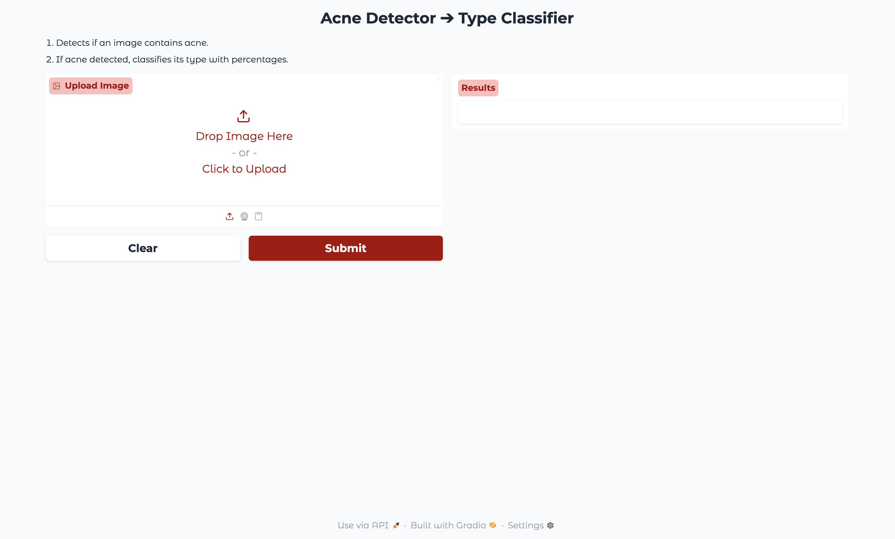
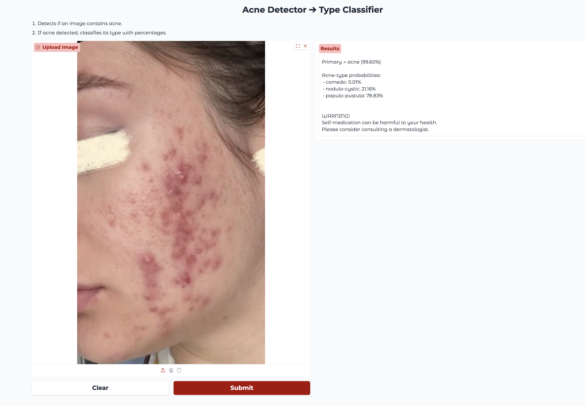
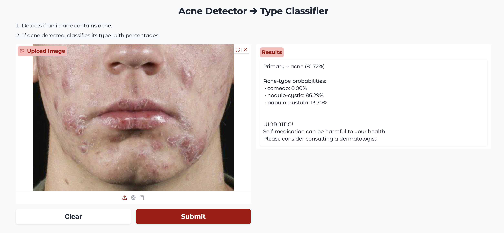
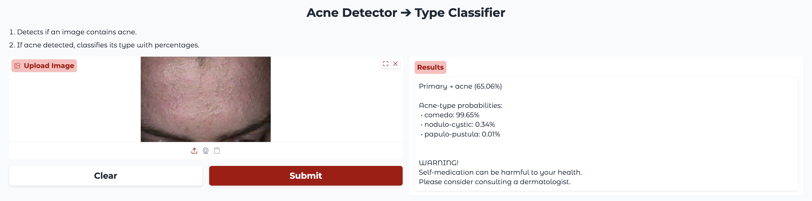
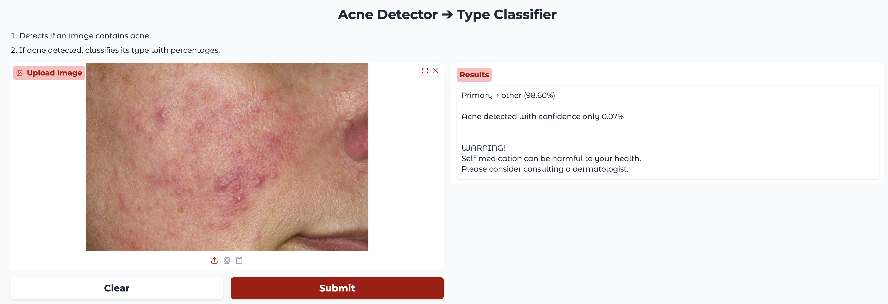
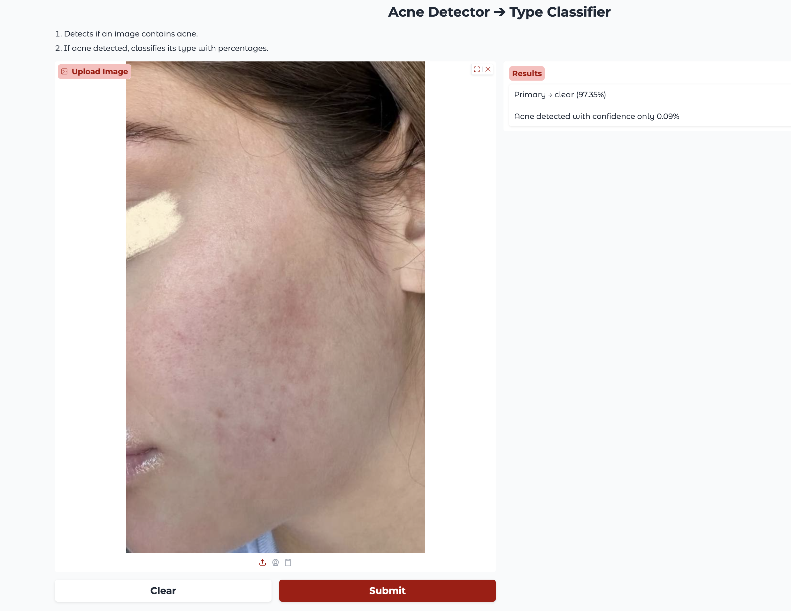

# Виявлення акне та визначення його типу


## Функціонал

- **Двоступенева система**: спочатку виявлення акне, потім класифікація його типу (комедональне, папуло-пустульозне, нодуло-кистозне).  
- **Компактні моделі**: YOLO11 Nano для виявлення акне (95 % точності) та YOLOv8 Nano для визначення його типу (85 % точності).  
- **Gradio UI**: інтуїтивний інтерфейс користувача для завантаження фото та миттєвого отримання результатів.


## Демонстрація

**Інтерфейс**:


**Приклад опрацювання системою зображення з папуло-пустульозним акне:**


**Приклад опрацювання системою зображення із нодуло-кистозним акне та папулами:**:


**Приклад опрацювання системою зображення з комедональним акне:**


**Приклад опрацювання системою зображення із розацеа (інші шкірні захворювання):**


**Приклад опрацювання системою зображення з чистою шкірою:**



## Локальний запуск

```
cd gui

python -m venv venv
source venv/bin/activate

pip install ultralytics gradio numpy

python main.py
```


